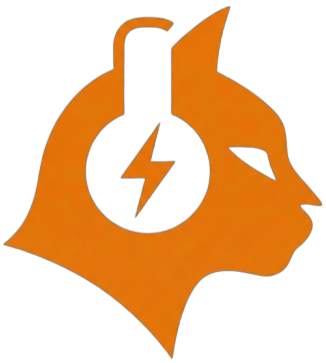

# ⚡ Rayito DJ - AI Audio Enhancement & Music Library Manager

  

  
  
  
  

**Rayito DJ** es una potente aplicación de escritorio diseñada para DJs y productores que utiliza **Inteligencia Artificial de última generación** para restaurar y mejorar la calidad de tu biblioteca musical. 

Transforma MP3s de baja calidad en audio de alta fidelidad, limpia mezclas turbias, detecta duplicados inteligentemente y rescata tracks antiguos. **Todo el procesamiento se realiza de forma 100% local y privada en tu equipo.**

---

## 📥 Descarga

Obtén la versión más reciente para tu sistema operativo. 

### [🚀 DESCARGAR RAYITO DJ (Versión Oficial)](https://github.com/alejandrovillaseca/rayito-dj-releases/releases/latest)

---

## 🛡️ Guía de Instalación Segura

Al ser Rayito DJ un software independiente y gratuito (sin pagar los $500 USD que Microsoft y Apple exigen por certificados), tu sistema mostrará una advertencia al intentar abrirlo. **Es un proceso normal y el software es totalmente seguro.**

### 🪟 En Windows (Cuadro Azul)
1. Haz clic en **"Más información"** (More info).
2. Selecciona el botón **"Ejecutar de todas formas"** (Run anyway).

### 🍎 En macOS (Gatekeeper)
1. Haz clic derecho (o Ctrl + Clic) sobre el ícono de la app y selecciona **"Abrir"**.
2. En el cuadro de diálogo, confirma haciendo clic en el botón **"Abrir"**.
*(Si no aparece, ve a Ajustes del Sistema > Privacidad y Seguridad y presiona "Abrir de todos modos")*.

---

## ✅ Verificación de Seguridad (VirusTotal)

Entendemos que la seguridad es lo primero. Hemos analizado nuestro instalador con más de 70 motores antivirus profesionales.

👉 **[VER REPORTE DE SEGURIDAD EN TIEMPO REAL](https://www.virustotal.com/gui/file-analysis/Y2JhN2I2ZmY5MTg4MDBkNzZlOGI3Njc2MzY2OWUxZDE6MTc3NDgzODEwNA==)**

*(Estado: 0/72 - Limpio de amenazas)*

---

## 🧠 El Poder de la IA en tu Estudio

Rayito DJ integra modelos de Machine Learning líderes en la industria para ofrecerte herramientas de restauración de audio sin precedentes:

* **🎸 Demucs (Meta AI) - Separación y Limpieza:** Separa cualquier track en sus stems originales (Vocales, Batería, Bajo, Otros). La IA procesa y limpia cada componente por separado para eliminar frecuencias turbias y luego los recombina en una mezcla cristalina. Ideal para tracks vintage o ripeos de vinilo.
* **🔊 AudioSR - Upsampling Super-Resolución:** ¿Tienes un MP3 clásico a 128kbps que suena plano en el club? AudioSR reconstruye las frecuencias agudas y graves perdidas por la compresión, convirtiendo audio de baja calidad en tracks de 48kHz con un rango dinámico restaurado.
* **✨ Modo Combo (Demucs + AudioSR):** El pipeline definitivo para tracks muy degradados. Primero aísla y limpia las impurezas, y luego reconstruye las frecuencias perdidas.
* **🎛️ DSP Local (Sin IA):** Para ajustes rápidos. Incluye ecualización profesional, compresión y realce armónico instantáneo.

## 🎚️ Funciones Diseñadas para DJs

Además de la IA, Rayito DJ es un gestor de biblioteca implacable:

* **Detección Inteligente de Duplicados:** No solo lee los nombres, analiza la *huella acústica* real del archivo. Encuentra el mismo track en diferentes calidades y te sugiere visualmente con cuál quedarte.
* **Análisis Profesional en Tiempo Real:** Detección precisa de **BPM** y **Key** (formato Camelot). Generación de espectrogramas en vivo y un *Score de Calidad* (0-100) basado en el bitrate y rango dinámico.
* **Gestión Masiva:** Arrastra carpetas con miles de tracks. Filtra, ordena y visualiza la forma de onda (*waveform*) directamente en la grilla.
* **Interfaz Dark Mode:** Optimizada para no fatigar la vista en estudios o cabinas de DJ con poca luz.

---

## 📝 Changelog (Registro de Cambios)

### v1.0.0 - Lanzamiento Oficial ⚡
* 🎉 **NUEVO:** Integración de motor de IA local (Demucs y AudioSR).
* 🎉 **NUEVO:** Sistema de análisis de audio (BPM, Key, Calidad).
* 🎉 **NUEVO:** Buscador inteligente de duplicados por huella acústica.
* ✨ **Mejora:** Interfaz oscura optimizada con previsualización de ondas vía Wavesurfer.js.
* 🔧 **Sistema:** Descarga automática de dependencias (FFmpeg) de forma transparente para el usuario.
* 🛡️ **Sistema:** Implementación de telemetría y reporte de errores anónimos.

*(Para ver el historial completo de versiones, visita la pestaña de [Releases](https://github.com/alejandrovillaseca/rayito-dj-releases/releases)).*

---

## 🤝 Soporte y Comunidad

Si encuentras un error visual, un track que la IA no pudo procesar correctamente, o tienes una idea genial para la próxima versión, ¡quiero escucharte!

👉 **[Reportar un Error o Sugerir una Mejora (Issues)](https://github.com/alejandrovillaseca/rayito-dj-releases/issues/new)**

---

## 📄 Licencia y Legal

Rayito DJ es un software **Freeware (Gratuito) de código cerrado**. 
Su uso está sujeto al **Acuerdo de Licencia de Usuario Final (EULA)**, el cual puedes revisar dentro de la aplicación o en el archivo `EULA.txt` adjunto en este repositorio.

Se prohíbe estrictamente la ingeniería inversa, descompilación o redistribución no autorizada. Las bibliotecas de terceros utilizadas (como FFmpeg, Wavesurfer.js, etc.) mantienen sus respectivas licencias de código abierto y son reconocidas en la sección "Acerca de" de la aplicación.

---

  <strong>Hecho con ⚡ y 🐾 en Chile por Rayito Dev © 2026</strong>

